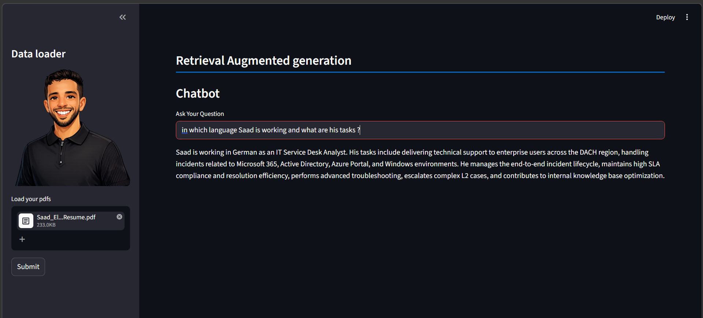

# Retrieval Augmented Generation Chatbot

A simple **Streamlit-based RAG application** that lets users upload one or more PDF files, converts their content into embeddings, stores them in a **Chroma** vector database, and answers questions using **OpenAI GPT-4o** based only on the retrieved document context.

## Features

- Upload multiple PDF files from the sidebar
- Extract text from PDFs using **PyPDF2**
- Split content into chunks with **RecursiveCharacterTextSplitter**
- Generate embeddings with **OpenAIEmbeddings**
- Store and retrieve chunks using **Chroma**
- Ask natural-language questions through a simple chatbot UI
- Generate answers grounded in uploaded document content

## Tech Stack

- **Python**
- **Streamlit**
- **LangChain**
- **OpenAI API**
- **Chroma Vector Store**
- **PyPDF2**

## Project Structure

```bash
.
├── rag.py          # Main Streamlit app
├── image.png       # Screenshot evidence
├── rag.png         # Avatar / chatbot image used in sidebar
└── README.md
```

## How It Works

1. The user uploads one or more PDF files.
2. The application reads and extracts text from each page.
3. The text is split into smaller chunks.
4. Each chunk is embedded using OpenAI embeddings.
5. The embeddings are stored in a Chroma vector database.
6. When the user asks a question, the app retrieves the most relevant chunks.
7. The retrieved context is injected into a prompt.
8. GPT-4o answers using only the retrieved context.

## Installation

Clone the project and install dependencies:

```bash
git clone <your-repository-url>
cd <your-project-folder>
pip install -r requirements.txt
```

If you do not have a `requirements.txt` yet, install the main packages manually:

```bash
pip install streamlit PyPDF2 langchain langchain-openai langchain-community langchain-text-splitters chromadb python-dotenv tiktoken
```

## Environment Variables

Create a `.env` file in the root of the project and add your OpenAI API key:

```env
OPENAI_API_KEY=your_api_key_here
```

## Run the App

```bash
streamlit run rag.py
```

Then open the local URL shown in the terminal, usually:

```bash
http://localhost:8501
```

## Example Usage

- Upload your resume, report, or documentation PDF
- Click **Submit**
- Ask a question such as:

```text
In which language is Saad working and what are his tasks?
```

The chatbot will retrieve the most relevant chunks from the uploaded file and generate an answer based on that context.

## Screenshot Evidence

Main app interface:




## Current Implementation Notes

- The app stores the retriever in `st.session_state`
- The answer is generated with `ChatOpenAI(model="gpt-4o", temperature=0)`
- Chunking currently uses:
  - `chunk_size=512`
  - `chunk_overlap=16`
- Retrieval currently uses top-k search with `k=5`

## Possible Improvements

- Add persistent Chroma storage
- Support DOCX and TXT files in addition to PDFs
- Add chat history memory
- Improve prompt formatting and error handling
- Prevent questions before documents are loaded
- Add source citations for retrieved chunks
- Deploy on Streamlit Community Cloud or another hosting platform

## Code Summary

The app is built around a straightforward RAG pipeline implemented in `rag.py`:

- **PDF loading** with `PdfReader`
- **Chunking** with `RecursiveCharacterTextSplitter`
- **Embeddings** with `OpenAIEmbeddings`
- **Vector retrieval** with `Chroma`
- **Answer generation** with `ChatOpenAI`

## Author

**Saad EL MABROUK**

---

This project demonstrates a clean and practical introduction to **Retrieval Augmented Generation (RAG)** using **Streamlit + LangChain + OpenAI**.